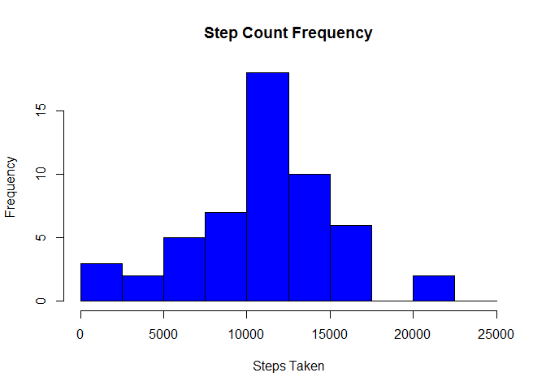
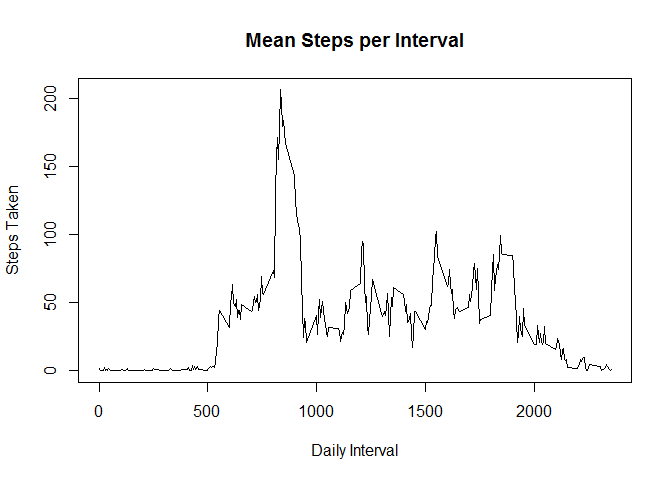
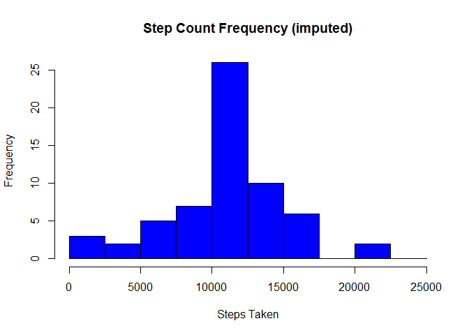
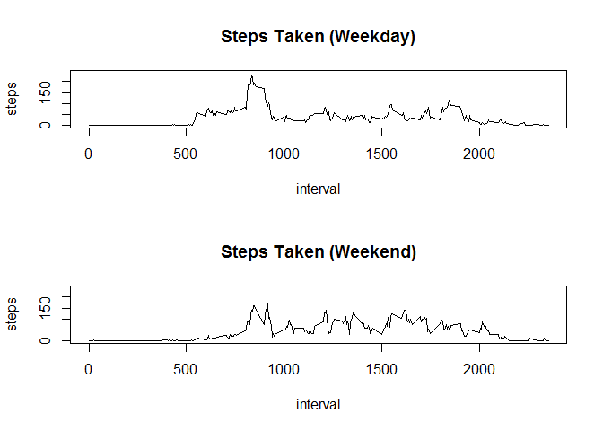

PA1\_template
================

GitHub Documents
----------------

This is an R Markdown format used for publishing markdown documents to GitHub. When you click the **Knit** button all R code chunks are run and a markdown file (.md) suitable for publishing to GitHub is generated.

R Markdown
----------

This is the work flow for Reproducible Research project \#1. First we'll import the data and look at the number of steps taken per day as well as the frequency of steps taken at intervals throughout the day and finally the mean and median steps taken at each interval.

``` r
library(dplyr)
```

    ## 
    ## Attaching package: 'dplyr'

    ## The following objects are masked from 'package:stats':
    ## 
    ##     filter, lag

    ## The following objects are masked from 'package:base':
    ## 
    ##     intersect, setdiff, setequal, union

``` r
library(date)
library(lubridate)
```

    ## 
    ## Attaching package: 'lubridate'

    ## The following object is masked from 'package:base':
    ## 
    ##     date

``` r
setwd("E:/Coursera/Reproducible Research/repdata%2Fdata%2Factivity/")
dat <- read.csv("activity.csv", header=T)
```

Grouping the data, summarizing step count and histogram

``` r
bydate <- group_by(dat,date)

sumCount <- summarize(bydate, s=sum(steps))
hist(sumCount$s, breaks = c(seq(0, 25000, 2500)), col = "blue", main = "Step Count Frequency", xlab = "Steps Taken")
```



And here the mean and median of the data set.

``` r
mean(sumCount$s, na.rm = TRUE); median(sumCount$s, na.rm=TRUE)
```

    ## [1] 10766.19

    ## [1] 10765

Now we'll look at the daily activity pattern.

``` r
byInterval <- group_by(dat, interval)
sumMean_interval <- summarize(byInterval, steps = mean(steps, na.rm = T))
with(sumMean_interval, plot(steps ~ interval, type = "l", main = "Mean Steps per Interval", xlab = "Daily Interval", ylab = "Steps Taken"))
```



And here is the peak movement time on an average day.

``` r
sumMean_interval$interval[which(sumMean_interval$steps == max(sumMean_interval$steps))]
```

    ## [1] 835

Now we'll address missing values in the data. First we'll assess how many there are in the dataset, then we'll use the mean interval value across all days to impute the values for a missing interval. We'll compile these into a new dataframe.

``` r
length(which(is.na(dat) == TRUE))
```

    ## [1] 2304

``` r
dat2 <- dat
for(i in 1:dim(dat2)[1]){
  if(is.na(dat2$steps[i]) == TRUE){
    dat2$steps[i] <- sumMean_interval$steps[which(sumMean_interval$interval == dat2$interval[i])]
  }
}
```

Now we'll compare results derived from the imputed dataset to the original and we'll see that there is a slight shift to higher values.

``` r
bydate2 <- group_by(dat2, date)

sumCount2 <- summarize(bydate2, s=sum(steps))
hist(sumCount2$s, breaks = c(seq(0, 25000, 2500)), col = "blue", main = "Step Count Frequency (imputed)", xlab = "Steps Taken")
```



``` r
mean(sumCount2$s); median(sumCount2$s)
```

    ## [1] 10766.19

    ## [1] 10766.19

``` r
sumMeanMed2 <- summarize(bydate2, mn=mean(steps), med=median(steps))
```

Lastly let's investigate weekend activity level versus weekday activity level by plotting activity throughout the day based on the average at each interval of weekends and weekdays.

But first we have to caress the data into a format for our analysis:

``` r
dat2$day <- weekdays(ymd(as.character(dat2$date))); dat2$weekday <- NA
for(i in 1:dim(dat2)[1]){
  if(dat2$day[i] == "Saturday" || dat2$day[i] == "Sunday"){
    dat2$weekday[i] <- "weekend"
  } else {dat2$weekday[i] <- "weekday"}
}
dat2$weekday <- as.factor(dat2$weekday)
by_weekday <- group_by(dat2, interval, weekday)
sumMean_interval_weekday <- summarize(by_weekday, steps = mean(steps))
```

And now we'll graph it:

``` r
par(mfrow=c(2,1))

with(sumMean_interval_weekday[sumMean_interval_weekday$weekday == "weekday",],  plot(steps ~ interval, main = "Steps Taken (Weekday)", ylim = c(0, 240), type = "l"))
with(sumMean_interval_weekday[sumMean_interval_weekday$weekday == "weekend",],  plot(steps ~ interval, main = "Steps Taken (Weekend)", ylim = c(0, 240), type = "l"))
```


